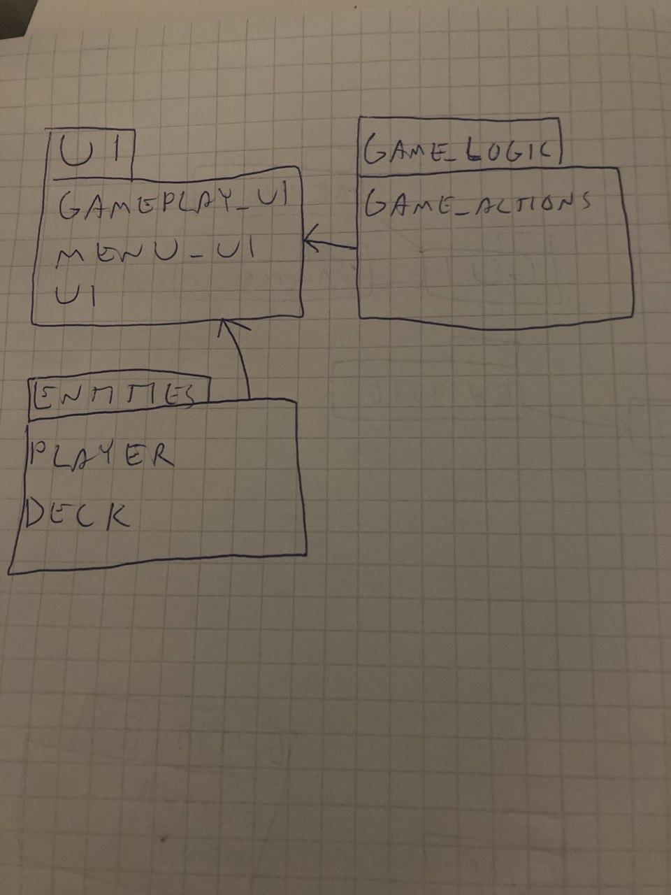
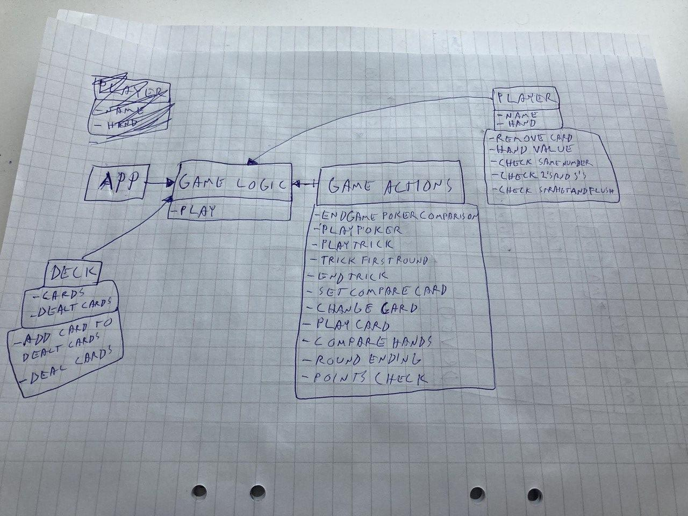
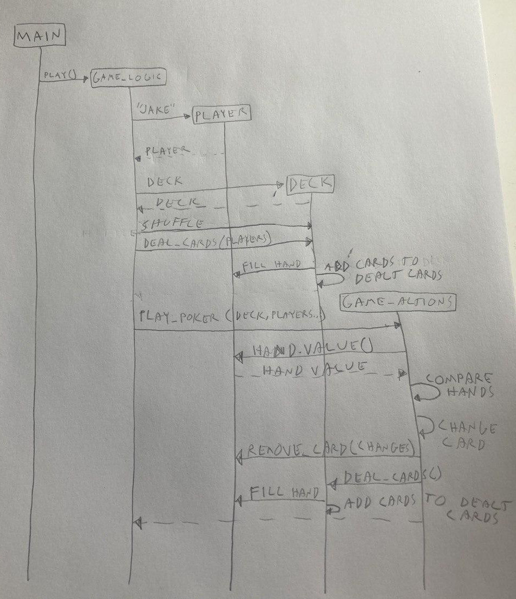

<h1> Arkkitehtuurikuvaus </h1>

<h2>Rakenne</h2>

Ohjelmassa on eriytettynä kolme eri pakkausta:

Pakkaus <i>ui</i> sisältää graafisen käyttöliittymän tiedostot. Pakkaus <i>entities</i> sisältää luokat pelaajalle ja korttipakalle. Pakkaus <i>game_logic</i> puolestaan sisältää pelin toiminnallisuudet.

<h2>Käyttöliittymä</h2>

Sovelluksen graafisessa käyttöliittymässä on kolme näkymää: Aloitusnäkymä, pelinäkymä ja loppunäkymä. Graafinen käyttöliittymä on eriytettynä pakkaukseen <i>ui</i>. Yksittäisiä kortteja koskevat pienet muutokset graafisessa käyttöliittymässä (esimerkiksi kortin valitseminen) löytyy pakkauksesta <i>game_logic</i> ja tarkemmin tiedostosta <i>game_actions</i>.

Luokka <i>GUI</i> on sovelluksen pääluokka, josta muita pakkauksia ja luokkia kutsutaan. 

<h2>Sovelluslogiikka</h2>
Toiminnallisuus on eriytettynä pakkauksen <i>game_logic</i> tiedostoon <i>game_actions</i>.

<h2> Luokkakaavio</h2>

Luokkakaavio ennen graafista käyttöliittymää. Graafisessa käyttöliittymässä on pääluokka <i>GUI</i>, joka löytyy tiedostosta <i>ui</i> sekä avustavat tiedostot <i>menu_ui</i> ja <i>gameplay_ui</i>

<h2> Sekvenssikaavio </h2>

Sekvenssikaaviossa esitettynä pokerikäden vertailu ja korttien jakaminen tekstikäyttöliittymästä. <i>game_logic</i>-tiedosto on sittemmin vaihtunut graafiseen käyttöliittymään, eli luokasta <i>GUI</i> kutsutaan pakkauksen <i> entities </i> luokkia <i>player</i> ja <i>deck</i>.
