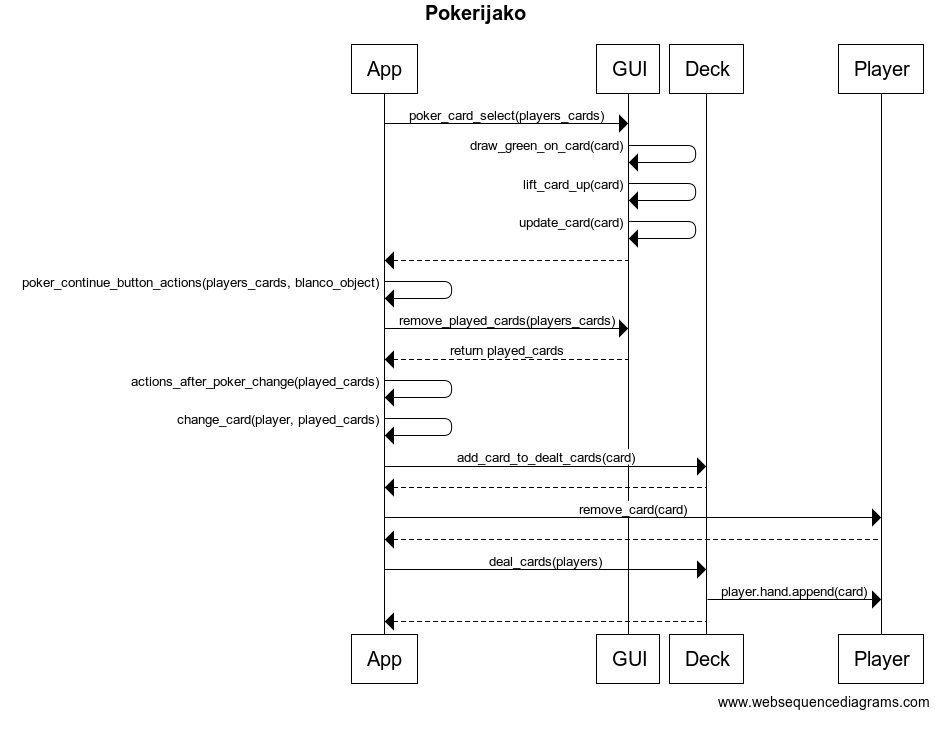

<h1> Arkkitehtuurikuvaus </h1>

<h2>Rakenne</h2>

Ohjelmassa on eriytettynä neljä eri pakkausta:  

 
Pakkaus <i>ui</i> sisältää graafisen käyttöliittymän tiedostot.  
Pakkaus <i>entities</i> sisältää luokat pelaajalle ja korttipakalle.  
Pakkaus <i>game_logic</i> sisältää sovelluslogiikan.  
Pakkaus <i>repository</i> sisältää tietokantaluokan. Kaikki toiminta tietokannan kanssa tapahtuu tämän luokan avulla.

<h2>Käyttöliittymä</h2>

Sovelluksen graafisessa käyttöliittymässä on kolme näkymää: Aloitusnäkymä, pelinäkymä ja loppunäkymä. Graafinen käyttöliittymä on eriytettynä pakkaukseen <i>ui</i>. 
Luokka <i>App</i> on sovelluksen pääluokka, josta muita pakkauksia ja luokkia kutsutaan.

<h2>Sovelluslogiikka</h2>
Toiminnallisuus on eriytettynä pakkauksen <i>game_logic</i> tiedostoon <i>game_actions</i> luokkaan <i>App</i>.

<h2> Luokkakaavio</h2>

Graafisessa käyttöliittymässä on luokka <i>GUI</i>, joka löytyy tiedostosta <i>ui</i> sekä avustavat tiedostot <i>menu_ui</i> ja <i>gameplay_ui</i>. Sovelluslogiikkaa suorittaa luokka <i>App</i>.  

<h2> Sekvenssikaaviot </h2>

Sekvenssikaaviossa esitettynä sovelluksen käynnistäminen. Muissa toiminnoissa kutsut toimivat näiden luokkien välillä.  

Toisessa sekvenssikaaviossa esitettynä pokerijako:  

