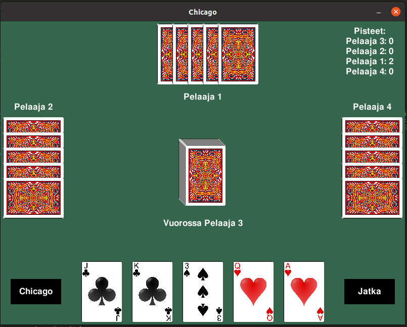

<h1>Käyttöohje</h2>
<h2> Pelin käynnistys </h2>
Kun avaat sovelluksen komennolla <i>poetry invoke run start</i>, näytöllesi aukeaa graafinen käyttöliittymä, joka näyttöö seuraavalta:

Pelin saat käynnistettyä painamalla "Aloita peli".

<h2> Pokeri </h2>

Peli käynnistyy ensimmäisenä pokerilla, joka näyttää tältä:

Vaihtokortit saat valittua klikkaamalla haluamiasi kortteja ja klikkaamalla "Jatka". Pelissä on 4 pelaajaa ja pokerikierroksia/vaihtoja on 2.

<h2> Tikki </h2>

Pokerikierroksen jälkeen vuoroon tulee tikki:

Tikissä ensimmäisenä vuorossa oleva asettaa pöydälle yhden kortin. Tästä kortista tulee vertailukortti, ja muiden pelaajien on pelattava tätä samaa maata. Jos toinen pelaaja pelaa samaa maata ja arvoltaan suuremman kortin, tulee tästä kortista vertailukortti. Kun kaikki ovat asettaneet yhden kortin pöydälle, vuoroa jatkaa edellisen kierroksen voittaja eli vertailukortin viimeisin asettaja. Tikkikierroksia on 5, eli pelataan kortit pois. Tikin viimeisen kierroksen voittaja saa 5 pistettä. Tällä hetkellä peli on asetettu loppumaan 10 pisteeseen, sitä voi halutessaan muuttaa.

<h2> Loppunäkymä </h2>

Kun peli loppuu, avautuu seuraava näkymä:

Pelin loputtua voit halutessasi aloittaa uuden pelin.