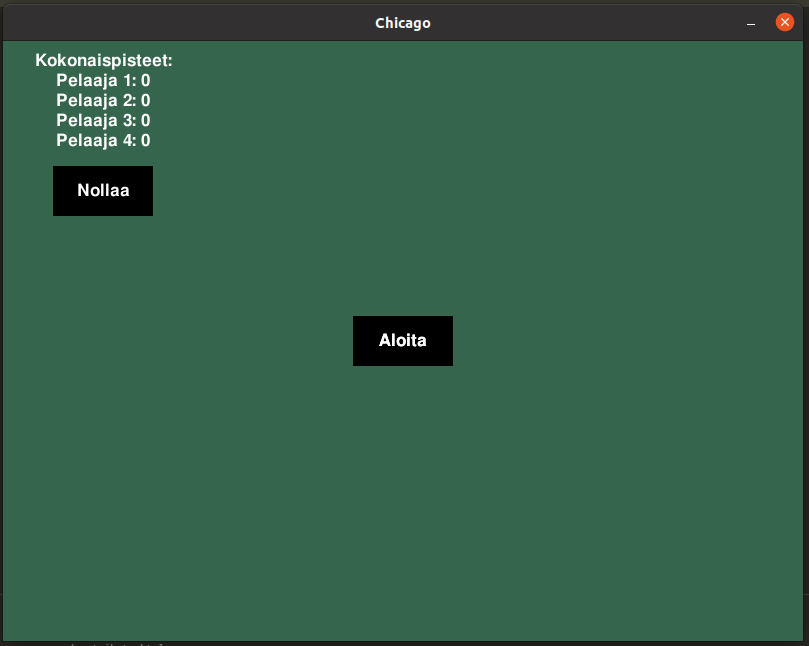
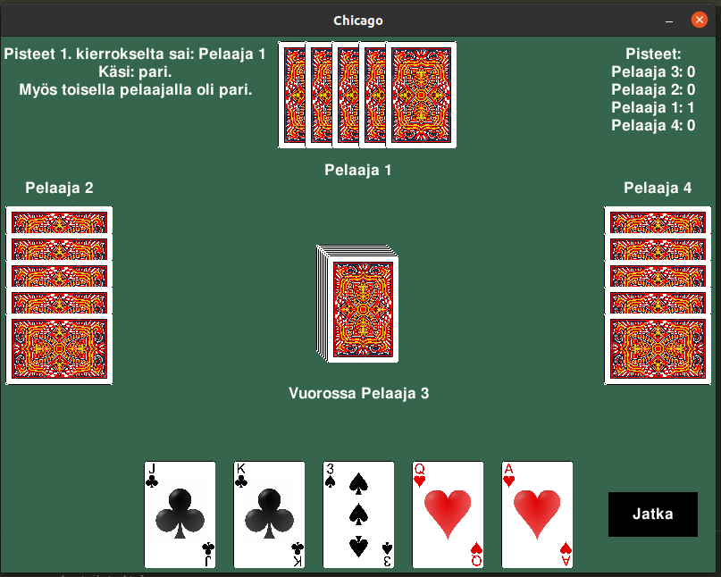

<h1>Käyttöohje</h2>
<h2> Pelin käynnistys </h2>
README:n ohjeiden avulla saat aluksi tarvittavat konfiguraatiot tehtyä. Kun avaat sovelluksen komennolla <i>poetry invoke run start</i>, näytöllesi aukeaa graafinen käyttöliittymä, joka näyttöö seuraavalta:

Pelin saat käynnistettyä painamalla "Aloita". Vasemmassa yläkulmassa näkyy lisäksi kokonaispistetilasto. Tilaston saa halutessaan nollattua painikkeesta sen alapuolelta. Mikäli kokonaispisteet ovat jo nollissa, nappi ei tee mitään näkyvää.

<h2> Pokeri </h2>

Peli käynnistyy ensimmäisenä pokerilla, joka näyttää suunnilleen tältä:

Vaihtokortit saat valittua klikkaamalla haluamiasi kortteja ja klikkaamalla "Jatka". Pelissä on 4 pelaajaa ja pokerikierroksia/vaihtoja on 2. Toisella pokerikierroksella on mahdollista aktivoida blanco-chicago, jolloin sinun on vaihdettava vähintään yksi kortti. Mikäli pelaaja huutaa blancon, eivät muut pelaajat voi tämän jälkeen enää huutaa blancoa tai chicagoa. Kummankin vaihtokierroksen yhteydessä jaetaan parhaasta pokerikädestä pisteet sivun alalaidassa olevan pisteytyslistan mukaan.

<h2> Tikki </h2>

Pokerikierroksen jälkeen vuoroon tulee tikki:

Chicago-painike on näkyvissä, mikäli kukaan ei huutanut blancoa. Chicago-painikkeen aktivoiminen ja "Jatka"-painikkeen painaminen palauttaa jo pelatut kortit pelaajille takaisin. Tikissä ensimmäisenä vuorossa oleva asettaa pöydälle yhden kortin. Tästä kortista tulee vertailukortti, ja muiden pelaajien on pelattava tätä samaa maata. Jos toinen pelaaja pelaa samaa maata ja arvoltaan suuremman kortin, tulee tästä kortista vertailukortti. Kun kaikki ovat asettaneet yhden kortin pöydälle, vuoroa jatkaa edellisen kierroksen voittaja eli vertailukortin viimeisin asettaja. Tikkikierroksia on viisi, eli pelataan kortit pois. Mikäli pelissä on huudettu blanco tai normaali chicago, sen huutajan on voitettava kaikki viisi tikkikierrosta. Tikin viimeisen kierroksen voittaja saa 5 pistettä. Jokaisen kierroksen (paitsi chicago-kierroksen) jälkeen lopussa tarkistetaan vielä pokerikäsi, ja paras käsi saa pisteet. Pisteytyksen löydät tämän tiedoston alareunasta.

Kuvassa peli on asetettu loppumaan 5 pisteeseen, sitä voi halutessaan muuttaa src/game_logic/game_actions-tiedostosta App-luokasta metodista points_check.

<h2> Loppunäkymä </h2>

Kun peli loppuu, avautuu seuraava näkymä:

Pelin loputtua voit halutessasi aloittaa uuden pelin.

<h2> Pisteytys </h2>
Pari: 1p  
Kaksi paria: 2p  
Kolmoset: 3p  
Suora: 4p  
Väri: 5p  
Täyskäsi: 6p  
Neloset: 8p (ja kaikki muut pelaajat tippuvat 0 pisteeseen)  
Värisuora: 52p (ja kaikki muut pelajaat tippuvat 0 pisteeseen, peli loppuu)  
Tikin lopetus: 5p  
Tikin lopetus kakkosella: 10p  
Chicago (onnistunut/epäonnistunut): 15/-15  
Blanco-chicago (onnistunut/epäonnistunut): 30/-30  