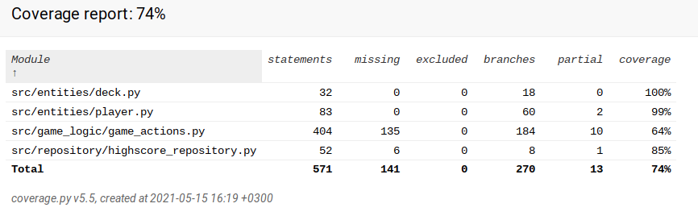

# Testausdokumentti
Sovellusta on testattu automatisoiduilla yksikkö- ja integraatiotesteillä unittestillä. Graafista käyttöliittymää on testattu pääasiassa manuaalisesti, testeistä osa kuitenkin käy myös graafisen käyttöliittymän puolella. Yhdessä testattavista metodeista on kymmenen sekunnin viive, minkä takia myös testit vievät tämän verran aikaa.

## Yksikkö- ja integraatiotestaus

### Sovelluslogiikka

Sovelluslogiikasta vastaavaa App-luokkaa testataan TestApp-testiluokalla. Testiluokka alustaa testeille välttämättömiä muuttujia ja olioita.

### Tietokanta

Tietokantaa testaa luokka TestDatabase. Luokassa alustetaan lisäksi App-luokka, jotta sovelluksen ja tietokannan välistä yhteyttä pystytään testaamaan. Testauksessa käytetään erillistä testitietokantaa.

### Pelaaja

Player-luokkaa testataan TestPlayer-testiluokalla. Alustuksessa luodaan Player-olio.

### Pakka

Deck-luokkaa testataan TestDeck-testiluokalla. Alustuksessa luodaan Deck-olio, sekä Player-olio.

### Testikattavuus

Käyttöliittymää lukuunottamatta testauksen haarautumakattavuus on 74%.  
  

Testeistä on jätetty pois osa sovelluslogiikasta, jotka ovat vahvasti kytköksissä graafiseen käyttöliittymään. Myös uuden pelin luominen tietokantaan on jätetty pois testissä ilmestyvän pelaaja-objektivirheen takia, jota ei esiinny manuaalisesti testattaessa.

## Järjestelmätestaus

Sovelluksen järjestelmätestaus on suoritettu manuaalisesti.

### Asennus ja konfigurointi

Testausta on suoritettu lataamalla sovellusta Githubin kautta parilla eri Linux-tietokoneella, sekä seuraamalla README:n ohjeita ja käyttöohjetta. 

### Toiminnallisuudet

Kaikki määrittelydokumentissa esitetyt toiminnallisuudet on käyty läpi ja todettu toimiviksi. Mahdolliset virhetilantenteet, kuten blanco-chicagon huutaminen ilman vaihtokorttia, on huomioitu ja sovellus ilmoittaa niistä käyttäjäystävällisellä tavalla.

